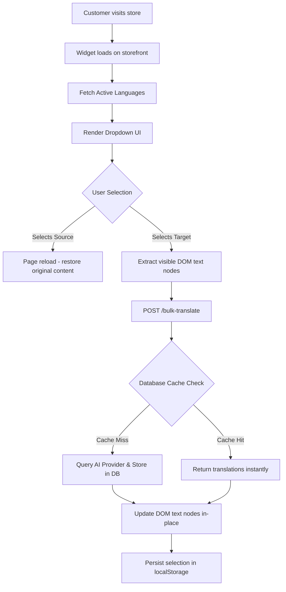

<div align="center">

# 🌐 Shopify Multilingual Translator

**Enterprise-grade, AI-powered translation application for Shopify storefronts. Translate your store into any language in real-time.**

[](https://flask.palletsprojects.com/)
[](https://react.dev/)
[](https://www.postgresql.org/)
[](https://shopify.dev/)
[](LICENSE)

[Live Demo](https://shopify-multilanguage-convertor-plugin.vercel.app/) · [Backend API](https://shopify-multilanguage-convertor.onrender.com) · [Report Bug](https://github.com/swastik3616/shopify-multilanguage-convertor/issues)

</div>

---

## 📖 Table of Contents

- [Overview](#-overview)
- [Key Features](#-key-features)
- [Architecture & Flow](#-architecture--flow)
- [Technology Stack](#-technology-stack)
- [Project Structure](#-project-structure)
- [Getting Started](#-getting-started)
  - [Prerequisites](#prerequisites)
  - [Local Development](#local-development)
- [Configuration](#-configuration)
- [API Reference](#-api-reference)
- [Supported AI Providers](#-supported-ai-providers)
- [Deployment](#-deployment)
- [License](#-license)

---

## 🎯 Overview

**Shopify Multilingual Translator** is a comprehensive, full-stack application designed to empower Shopify merchants with seamless, AI-driven localization. By integrating a dynamic, floating widget directly into the storefront, customers can translate all visible page content in real-time. 

To ensure optimal performance and minimize API costs, translations are intelligently cached in a PostgreSQL database. Subsequent requests for the same content are served instantly without invoking additional AI processing.

---

## ✨ Key Features

- 🤖 **Multi-Model AI Translation**: Seamlessly integrate with industry-leading LLMs including OpenAI, Google Gemini, Anthropic Claude, Groq, and local Ollama models.
- ⚡ **Intelligent Caching**: Persist translated content in PostgreSQL, ensuring zero latency and zero cost for repeated text translations.
- 🌍 **Storefront Integration**: Deploy a fully accessible, customizable floating language switcher injected seamlessly via Shopify App Extensions.
- 🔒 **Merchant Controls**: Granular control over active source and target languages directly from the admin dashboard.
- 📦 **Batched Processing**: Optimize performance by processing all visible DOM text nodes in a single, batched API request.
- 🔍 **SEO Optimization**: Translate vital product and page metadata (titles, descriptions) natively via the Shopify GraphQL API.
- 📊 **Analytics & Auditing**: Monitor active languages, translation volume, provider health, and comprehensive audit logs through the React-based admin dashboard.
- 🖥️ **Translation Workspace**: A dedicated Side-by-Side UI mapping your exact website layout (HTML semantic tags) for manual translation review and editing.

---

## 🔄 Architecture & Flow

The system employs a smart caching layer between the Shopify storefront and the AI translation providers to ensure rapid delivery of localized content.



---

## 🛠 Technology Stack

### Backend Infrastructure
- **Framework**: Python 3.9+ with Flask (Modular Blueprints)
- **Database**: PostgreSQL (Production) / SQLite (Local) via SQLAlchemy ORM
- **Server**: Gunicorn WSGI
- **Hosting**: Render

### Frontend Dashboard
- **Framework**: React 19 + Vite 8
- **Styling**: Tailwind CSS v4
- **State/Routing**: React Router v7
- **Data Visualization**: Recharts
- **Hosting**: Vercel

### Shopify Integration
- **Tooling**: Shopify CLI
- **Templates**: Liquid (Storefront App Extension)
- **Authentication**: Standard OAuth 2.0 Flow

---

## 📁 Project Structure

```text
shopify-multilingual-translator/
├── backend/                              # Python Flask REST API
│   ├── app.py                            # Application factory & initialization
│   ├── routes/                           # Modular API endpoints (auth, translation, seo)
│   ├── utils/                            # Core logic (AI providers, Shopify clients)
│   └── requirements.txt                  # Python dependencies
├── frontend/                             # React Admin Application
│   ├── src/
│   │   ├── pages/                        # Dashboard, Settings, Translation UI
│   │   ├── components/                   # Reusable UI elements
│   │   └── services/                     # API integration layer
│   └── package.json                      # Node dependencies
└── language-multilingual-translato/      # Shopify CLI Extension
    └── extensions/
        └── multilingual-language-switcher/
            └── blocks/                   # Liquid theme app blocks
```

---

## 🚀 Getting Started

### Prerequisites

Ensure the following tools are installed in your development environment:
- [Node.js](https://nodejs.org/) (v18 or higher)
- [Python](https://www.python.org/) (v3.9 or higher)
- [Shopify CLI](https://shopify.dev/docs/apps/tools/cli) (`npm install -g @shopify/cli`)
- A [Shopify Partner Account](https://partners.shopify.com/) with an active development store.

### Local Development

**1. Backend Setup**
```bash
git clone https://github.com/swastik3616/shopify-multilanguage-convertor.git
cd shopify-multilingual-translator/backend

# Create and activate virtual environment
python -m venv venv
source venv/bin/activate  # On Windows: venv\Scripts\activate

# Install dependencies
pip install -r requirements.txt

# Start development server
python app.py
```

**2. Frontend Setup**
```bash
cd ../frontend
npm install
npm run dev
```

**3. Shopify Extension**
```bash
cd ../language-multilingual-translato
npm install
shopify app dev
```

*Note: Add the "Language Switcher Global" block to your theme's Footer section via the Shopify Theme Customizer to enable the widget globally.*

---

## ⚙️ Configuration

1. **Connect Store**: Navigate to **Store Settings** in the dashboard. Enter your `.myshopify.com` domain and Admin API Access Token.
2. **Configure AI**: Go to **Providers**, select your desired AI engine (e.g., OpenAI, Gemini), and input your API key.
3. **Set Languages**: Define your store's native **Source Language** and enable specific **Target Languages** for translation.

---

## 📡 API Reference

### Core Endpoints

| Endpoint | Method | Description |
|---|---|---|
| `/bulk-translate` | `POST` | Translates an array of text strings utilizing caching mechanisms. |
| `/get-languages` | `GET` | Retrieves the active source and target language configuration. |
| `/translations` | `GET` | Fetches the paginated translation cache. |
| `/api/dashboard` | `GET` | Aggregates real-time analytics for the admin dashboard. |
| `/api/seo-translate`| `POST` | Pushes translated SEO metadata directly to the Shopify GraphQL API. |

---

## 🤖 Supported AI Providers

- **OpenAI** (`gpt-4o`, `gpt-4`, `gpt-3.5-turbo`): Industry standard for quality and nuance.
- **Google Gemini** (`gemini-2.0-flash`, `gemini-1.5-pro`): High performance and cost-effective.
- **Anthropic Claude** (`claude-3-haiku`, `claude-3-sonnet`): Exceptional contextual understanding.
- **Groq** (`llama3`, `mixtral`): Ultra-low latency inference.
- **Ollama**: Local model execution for zero-cost, private translation.

---

## 🚢 Deployment

### Production Guidelines

- **Backend (Render)**: Deploy the `backend` directory as a Web Service. Set the Build Command to `pip install -r requirements.txt` and Start Command to `gunicorn app:app`. Ensure a PostgreSQL instance is provisioned and linked via the `DATABASE_URL` environment variable.
- **Frontend (Vercel)**: Import the `frontend` directory. Ensure `VITE_API_URL` is set to your production backend URL. The included `vercel.json` automatically manages the CSP `frame-ancestors` directive required by Shopify.
- **Extension**: Run `shopify app deploy` from the extension directory to publish widget updates to the Shopify CDN.

---

## 📄 License

This project is licensed under the [MIT License](LICENSE).

<div align="center">
  <br/>
  Built for the modern Shopify ecosystem. <br/>
  <a href="#-shopify-multilingual-translator">⬆ Back to Top</a>
</div>
