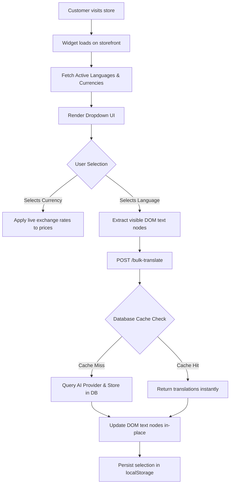

<div align="center">

# 🌐 Shopify Multilingual & Multi-Currency Translator

**Enterprise-grade, AI-powered localization app for Shopify storefronts. Translate text and convert currencies in real-time.**

[](https://flask.palletsprojects.com/)
[](https://react.dev/)
[](https://www.postgresql.org/)
[](https://shopify.dev/)
[](LICENSE)

[Live Demo](https://shopify-multilanguage-convertor-plugin.vercel.app/) · [Backend API](https://shopify-multilanguage-convertor.onrender.com) · [Report Bug](https://github.com/swastik3616/shopify-multilanguage-convertor/issues)

</div>

---

## 📖 Table of Contents

- [Overview](#-overview)
- [Key Features](#-key-features)
- [Architecture & Flow](#-architecture--flow)
- [Technology Stack](#-technology-stack)
- [Project Structure](#-project-structure)
- [Getting Started](#-getting-started)
  - [Prerequisites](#prerequisites)
  - [Local Development](#local-development)
- [Configuration](#-configuration)
- [API Reference](#-api-reference)
- [Supported AI Providers](#-supported-ai-providers)
- [Deployment](#-deployment)
- [License](#-license)

---

## 🎯 Overview

**Shopify Multilingual & Multi-Currency Translator** is a comprehensive, full-stack application designed to empower Shopify merchants with seamless, AI-driven localization. By integrating dynamic, floating widgets directly into the storefront, customers can translate all visible page content and seamlessly convert product currencies in real-time.

To ensure optimal performance and minimize API costs, translations are intelligently cached in a PostgreSQL database using an ORM model. Subsequent requests for the same content are served instantly without invoking additional AI processing. The application features robust integrated Shopify billing, comprehensive webhook handling, and merchant analytics.

---

## ✨ Key Features

- 🤖 **Multi-Model AI Translation**: Seamlessly integrate with industry-leading LLMs including OpenAI, Google Gemini, Anthropic Claude, Groq, and local Ollama models.
- 💱 **Multi-Currency Conversion**: Automatic detection and real-time conversion of storefront prices and currencies to match user locale preferences.
- ⚡ **Intelligent Caching**: Persist translated content in PostgreSQL, ensuring zero latency and zero cost for repeated text translations.
- 🌍 **Storefront Integration**: Deploy fully accessible, customizable floating language & currency switchers injected seamlessly via Shopify App Extensions.
- 💳 **Integrated Shopify Billing**: Seamless subscription management using the official Shopify GraphQL AppSubscription APIs.
- 🔒 **Merchant Controls**: Granular control over active source/target languages, supported currencies, and active subscriptions directly from the App Bridge dashboard.
- 📦 **Batched Processing**: Optimize performance by processing all visible DOM text nodes in a single, batched API request.
- 🔍 **SEO Optimization**: Translate vital product and page metadata (titles, descriptions) natively via the Shopify GraphQL API.
- 🔄 **Automated Webhooks**: Keep shop data and billing states perfectly synchronized via reliable webhook processing endpoints.
- 🖥️ **Translation Workspace**: A dedicated Side-by-Side UI mapping your exact website layout (HTML semantic tags) for manual translation review and editing.
- 📊 **Observability & Monitoring**: Built-in Prometheus metrics exporter coupled with Grafana Alloy for real-time performance tracking and system observation.

---

## 🔄 Architecture & Flow

The system employs a smart caching layer between the Shopify storefront and the AI translation providers to ensure rapid delivery of localized content.


```mermaid
graph TD
    A[Customer visits store] --> B[Widget loads on storefront]
    B --> C[Fetch Active Languages & Currencies]
    C --> D[Render Dropdown UI]
    D --> E{User Selection}
    E -->|Selects Currency| F[Apply live exchange rates to prices]
    E -->|Selects Language| G[Extract visible DOM text nodes]
    G --> H[POST /bulk-translate]
    H --> I{Database Cache Check}
    I -->|Cache Hit| J[Return translations instantly]
    I -->|Cache Miss| K[Query AI Provider & Store in DB]
    K --> L[Update DOM text nodes in-place]
    J --> L
    L --> M[Persist selection in localStorage]
```

---

## 🛠 Technology Stack

### Backend Infrastructure
- **Framework**: Python 3.9+ with Flask (Modular Blueprints)
- **Database**: PostgreSQL (Production) / SQLite (Local) via SQLAlchemy ORM & Alembic Migrations
- **Architecture**: Modular application factory pattern with robust CORS and Error handling
- **Observability**: Prometheus Metrics (flask-exporter) & Grafana Alloy
- **Server**: Gunicorn WSGI
- **Hosting**: Render,graphana

### Frontend Dashboard
- **Framework**: React 19 + Vite 8
- **Shopify Integration**: App Bridge React v4
- **Styling**: Tailwind CSS v4 & Framer Motion
- **State/Routing**: React Router v7
- **Data Visualization**: Recharts
- **Hosting**: Vercel

### Shopify Integration
- **Tooling**: Shopify CLI
- **Templates**: Liquid (Storefront App Extension)
- **Authentication**: Standard OAuth 2.0 Flow
- **Monetization**: Shopify Billing APIs

---

## 📁 Project Structure

```text
shopify-multilingual-translator/
├── backend/                              # Python Flask REST API
│   ├── app.py                            # Application factory & initialization
│   ├── config.py                         # Environment configurations
│   ├── models/                           # SQLAlchemy ORM Models (Merchant, Subscription, etc.)
│   ├── routes/                           # Modular API endpoints (auth, translation, billing, seo, webhooks, currency)
│   ├── utils/                            # Core logic (AI providers, Shopify clients)
│   └── requirements.txt                  # Python dependencies
├── frontend/                             # React Admin Application (Shopify App Bridge)
│   ├── src/
│   │   ├── pages/                        # Dashboard, Settings, Translation UI
│   │   ├── components/                   # Reusable UI elements
│   │   └── services/                     # API integration layer
│   └── package.json                      # Node dependencies
└── language-multilingual-translato/      # Shopify CLI Extension
    └── extensions/
        └── multilingual-language-switcher/
            └── blocks/                   # Liquid theme app blocks
```

---

## 🚀 Getting Started

### Prerequisites

Ensure the following tools are installed in your development environment:
- [Node.js](https://nodejs.org/) (v18 or higher)
- [Python](https://www.python.org/) (v3.9 or higher)
- [Shopify CLI](https://shopify.dev/docs/apps/tools/cli) (`npm install -g @shopify/cli`)
- A [Shopify Partner Account](https://partners.shopify.com/) with an active development store.

### Local Development

**1. Backend Setup**
```bash
git clone https://github.com/swastik3616/shopify-multilanguage-convertor.git
cd shopify-multilingual-translator/backend

# Create and activate virtual environment
python -m venv venv
source venv/bin/activate  # On Windows: venv\Scripts\activate

# Install dependencies
pip install -r requirements.txt

# Start development server
python app.py
```

**2. Frontend Setup**
```bash
cd ../frontend
npm install
npm run dev
```

**3. Shopify Extension**
```bash
cd ../language-multilingual-translato
npm install
shopify app dev
```

*Note: Add the "Language Switcher Global" block to your theme's Footer section via the Shopify Theme Customizer to enable the widget globally.*

---

## ⚙️ Configuration

1. **Environment Setup**: Populate `.env` with your `SHOPIFY_CLIENT_ID`, `SHOPIFY_CLIENT_SECRET`, and `DATABASE_URL`.
2. **Connect Store**: Install the app on your Shopify development store to initialize standard OAuth flow.
3. **Approve Billing**: Merchant accepts the recurring AppSubscription charges in the dashboard.
4. **Configure AI**: Go to **Providers**, select your desired AI engine (e.g., OpenAI, Gemini), and input your API key.
5. **Set Languages/Currencies**: Define your store's native **Source Language** and enable specific **Target Languages** and **Currencies**.

---

## 📡 API Reference

### Core Endpoints

| Endpoint | Method | Description |
|---|---|---|
| `/bulk-translate` | `POST` | Translates an array of text strings utilizing caching mechanisms. |
| `/get-languages` | `GET` | Retrieves the active source and target language configuration. |
| `/api/billing/*` | `GET`/`POST` | Handles subscription creation, verification, and Shopify billing redirects. |
| `/api/webhooks/*`| `POST` | Processes Shopify webhook topics (e.g., app/uninstalled, subscriptions/update). |
| `/currency.js`   | `GET` | Serves the dynamic storefront widget script for currency conversion. |
| `/storefront.js` | `GET` | Serves the dynamic storefront widget script for text translation. |
| `/api/seo-translate`| `POST`| Pushes translated SEO metadata directly to the Shopify GraphQL API. |

---

## 🤖 Supported AI Providers

- **OpenAI** (`gpt-4o`, `gpt-4`, `gpt-3.5-turbo`): Industry standard for quality and nuance.
- **Google Gemini** (`gemini-2.0-flash`, `gemini-1.5-pro`): High performance and cost-effective.
- **Anthropic Claude** (`claude-3-haiku`, `claude-3-sonnet`): Exceptional contextual understanding.
- **Groq** (`llama3`, `mixtral`): Ultra-low latency inference.
- **Ollama**: Local model execution for zero-cost, private translation.

---

## 🚢 Deployment

### Production Guidelines

- **Backend (Render)**: Deploy the `backend` directory as a Web Service. Set the Build Command to `pip install -r requirements.txt` and Start Command to `gunicorn app:app`. Ensure a PostgreSQL instance is provisioned and linked via the `DATABASE_URL` environment variable. Alembic migrations should be run on initialization. For monitoring, run Grafana Alloy with `config.alloy` and set the `GRAFANA_TOKEN` environment variable.
- **Frontend (Vercel)**: Import the `frontend` directory. Ensure `VITE_API_URL` is set to your production backend URL. The included `vercel.json` automatically manages the CSP `frame-ancestors` directive required by Shopify App Bridge.
- **Extension**: Run `shopify app deploy` from the extension directory to publish widget updates to the Shopify CDN.

---

## 📄 License

This project is licensed under the [MIT License](LICENSE).

<div align="center">
  <br/>
  Built for the modern Shopify ecosystem. <br/>
  <a href="#-shopify-multilingual--multi-currency-translator">⬆ Back to Top</a>
</div>
